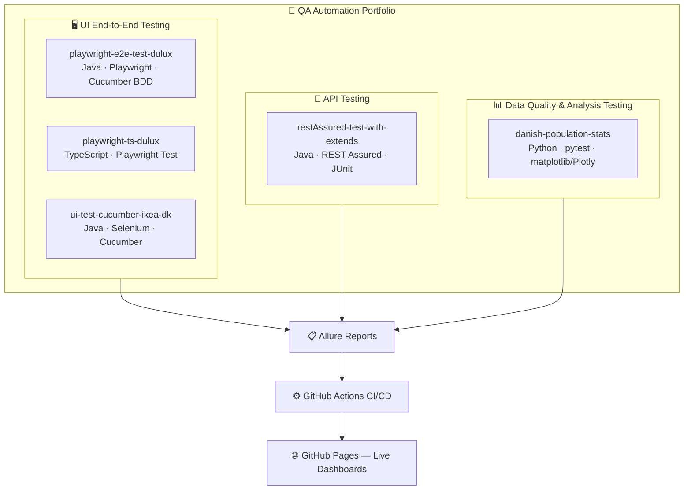

<h1 align="center">Hi, I'm Magdalena 👋</h1>

<h3 align="center">Senior QA Test Engineer with hands-on manual testing expertise and a Java background, now transitioning into test automation — building production-style frameworks from real testing experience, not from scratch</h3>

<h3 align="center">Senior QA Test Engineer · Currently leveling up into Test Automation — Java · TypeScript · Playwright · Selenium · REST Assured · Python</h3>

  
  
  
  
  
  
  
  
  
  

As a Senior QA, I'm now building hands-on automation skills through real-world style frameworks — Page Object Model, BDD with Cucumber, API testing, CI/CD pipelines, and live Allure dashboards published to GitHub Pages. Every project below ships with a real, working CI pipeline you can click into.

---

## 🧭 Portfolio Architecture

How the five projects map onto the test pyramid — same testing principles, applied across UI, API, and data layers.

**Shared principles across every project:** Page Object Model · clean separation of assertions from page logic · tagged test suites (`@smoke` / `@regression`) · CI on every push/PR · Allure reporting with screenshot-on-failure · published live reports.

---

## 🚀 Projects

| Project | Stack | What it tests | Live Report |
|---|---|---|---|
| **[playwright-e2e-test-dulux](https://github.com/magdaU/playwright-e2e-test-dulux)** | Java · Playwright · Cucumber BDD · Allure · Docker | UI e2e on dulux.co.uk — desktop & mobile customer journeys | [🔗 Allure](https://magdau.github.io/playwright-e2e-test-dulux/) |
| **[playwright-ts-dulux](https://github.com/magdaU/playwright-ts-dulux)** | TypeScript · Playwright Test · Allure · Docker | Same Dulux journeys in TS — API setup checks, trace viewer, parallel execution | [🔗 Allure](https://magdau.github.io/playwright-ts-dulux/) |
| **[ui-test-cucumber-ikea-dk](https://github.com/magdaU/ui-test-cucumber-ikea-dk)** | Java · Selenium · Cucumber · Spring Boot | UI e2e on ikea.com/dk — product search & pricing flows | Allure generated locally |
| **[restAssured-test-with-extends](https://github.com/magdaU/restAssured-test-with-extends)** | Java · REST Assured · JUnit4 | API testing — CRUD, schema validation (JSON/XML), negative & parameterized tests | [🔗 Allure](https://magdau.github.io/restAssured-test-with-extends/) |
| **[danish-population-stats](https://github.com/magdaU/danish-population-stats)** | Python · pytest · matplotlib · Plotly | Data quality, regression & domain-logic testing on real demographic data | [🔗 Allure](https://magdau.github.io/danish-population-stats/) |

---

## 🛠️ What you'll find in these repos

- ✅ **Page Object Model** with shared base classes & component objects
- ✅ **BDD layer** (Cucumber/Gherkin) describing behaviour in business language
- ✅ **CI/CD pipelines** (GitHub Actions) running smoke/regression suites on every push
- ✅ **Allure reporting** — screenshots on failure, historical trend, severity levels, published to GitHub Pages
- ✅ **Dockerized test execution** — no local setup required to run the suites
- ✅ **Negative & parameterized testing**, JSON/XML schema validation, data integrity checks
- 🔜 Currently working on: visual regression testing, mutation testing, cross-browser CI matrices

---

## 📫 Get in touch

  <a href="https://www.linkedin.com/in/YOUR-LINKEDIN-HANDLE">https://www.linkedin.com/in/magdalena-ukleja-qa/</a>
  <a href="mailto:YOUR-EMAIL@example.com">magdalena.ukleja@gmail.com</a>

